# 微光远征 GlimmerExpedition · 方案设计报告

> 大学生游戏化运动激励 Web 应用 · 把现实运动转化为奇幻冒险

| 入口 | 链接 |
|---|---|
| 🌐 在线体验 | **https://glimmer-expedition.netlify.app** |
| 📦 源码仓库 | https://github.com/zyqyyds3344/glimmer-expedition |
| 🔌 后端 API | https://glimmer-expedition.onrender.com/api/health |

体验账号：`晨曦小鹿 / 123456`

> 首次打开稍慢（10–60 秒）是 Render 免费档冷启动，刷新即可。

---

## 目录

1. [产品定位与核心洞察](#一产品定位与核心洞察)
2. [设计理念与原则](#二设计理念与原则)
3. [信息架构与用户旅程](#三信息架构与用户旅程)
4. [核心页面详解](#四核心页面详解)
5. [视觉与交互系统](#五视觉与交互系统)
6. [核心玩法机制](#六核心玩法机制)
7. [AI 能力 · Lumi 精灵](#七ai-能力--lumi-精灵)
8. [技术架构](#八技术架构)
9. [数据模型](#九数据模型)
10. [部署与上线](#十部署与上线)
11. [差异化亮点](#十一差异化亮点)
12. [未来规划](#十二未来规划)

---

## 一、产品定位与核心洞察

### 目标用户
**大学生**，他们：
- 知道运动重要，但**没有目标 + 没有反馈** → 三天打鱼两天晒网
- 在宿舍 / 教室 / 操场之间切换，**碎片化时间多**，整块运动时间少
- **怕孤独 + 怕枯燥**，被传统 Keep 类工具的"任务感"压力劝退
- 喜欢**游戏化、视觉化、有仪式感**的产品

### 三个核心痛点

| 痛点 | 传统运动 App 怎么做 | 我们的回答 |
|---|---|---|
| 不知道今天该做什么 | 长长的训练库让用户自己挑 | **今日 3 张能量卡 + Lumi 推荐**，零决策 |
| 坚持不下来 | 数据列表 + 打卡红字 | **世界树会因为你的运动长大**，反馈即时且诗意 |
| 一个人没动力 | 朋友圈晒图 | **微光之约**：双方进度同屏 + 提醒 + 拯救动画 |

### 一句话表达
> **「把每一次运动转化为微光，浇灌一棵只属于你的世界树。」**

---

## 二、设计理念与原则

### 1. 反工具感，强叙事感
不做 KPI 看板，做**奇幻成长游戏**。所有抽象数据都被翻译成具象隐喻：

| 抽象 | 具象 |
|---|---|
| 累计能量 | 微光（一种发光粒子） |
| 等级提升 | 世界树成长阶段 · 幼苗 → 成长 → 传说 |
| 任务完成 | 能量卡片合成护盾 |
| 高强度区间 | 心流暴击 · 收藏艺术卡 |
| 长期约定 | 微光之约 · 双方契约 |

### 2. 即时反馈优于事后统计
每个核心动作都有：
- **Toast 微光提示**（如 "+30 微光，世界树呼吸了一下"）
- **粒子动画 / 渐变发光**（不是冰冷的数字跳变）
- **阶段进化弹窗**（升级时全屏仪式感）

### 3. AI 不是问答机器，是温柔的同伴
Lumi 不输出"建议你跑 30 分钟"这种命令式语句，而是：
- 回应情绪："今天不想动？我们一起做 3 分钟深呼吸吧。"
- 提供"软任务"替换权：用户一键替换今日卡片
- 永远不指责中断，只欢迎回归

### 4. 深色为主 / 浅色可切
深色更像奇幻夜空，是默认审美；但有些用户白天用着累，所以**右上角一键切换浅色**，全站 CSS 变量驱动。

---

## 三、信息架构与用户旅程

### 站点地图

```
/login                登录 / 注册
  ↓
/onboarding           首次入口 · 5 题问卷 · Lumi 生成 7 天计划
  ↓
/                     岛屿（今日行动中心 · 默认页）
  ├── /sport          运动记录页（含心流暴击）
  ├── /lumi           Lumi 精灵对话（凸起底部中央）
  ├── /social         搭子契约
  ├── /achievement    徽章墙
  └── /profile        我的（角色面板 + 数据 + 主题切换入口）
```

### 关键流（First-time User Journey）

1. **登录** → 检测 `onboarded=false` → 强制跳 Onboarding
2. **5 题问卷**：目标 / 当前运动频率 / 时长偏好 / 场景 / 喜好类型
3. **AI 生成动画**（Lumi 精灵浮现） → **7 天奇幻计划揭幕**
4. 进入岛屿首页 → 看到世界树和今日 3 张能量卡 → 点击完成第一张
5. 触发首次 Toast + 树呼吸动画 + 微光数字跳动
6. 返回首页底部能量卡进度条点亮 1/3

---

## 四、核心页面详解

### 4.1 登录 / 注册 · `/login`

<p align="center">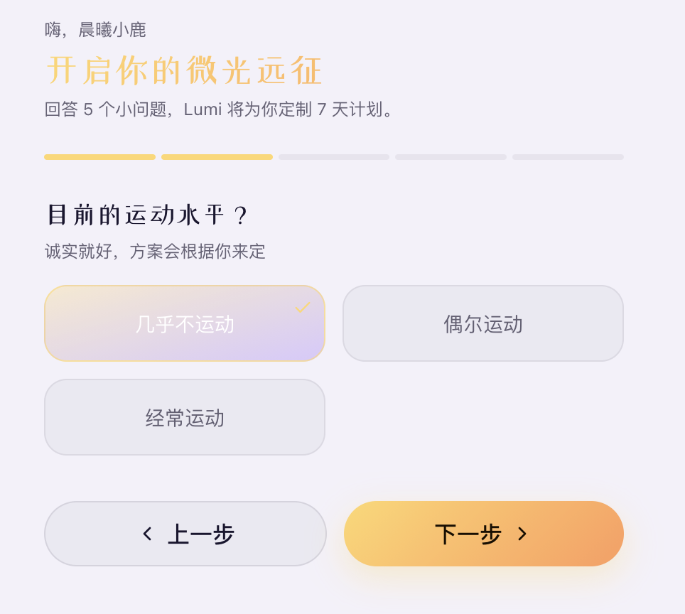</p>

**功能要点**
- 昵称 + 密码登录或注册（无邮箱无验证码）
- 主标题"微光远征"使用渐变金，副标题"把每次运动，化作世界树的微光"开门见山
- 底部默认账号 `晨曦小鹿 / 123456` 作为 Demo 入口

**为什么这样设计**
- 大学生 demo 场景下注册门槛要极低，不能让用户在表单上犹豫
- 用昵称代替手机号 / 邮箱，更贴合"奇幻角色"叙事
- 浅色玻璃卡 + 金色 sparkle 图标第一眼奠定整个产品的"微光 + 治愈"基调

---

### 4.2 引导问卷 · `/onboarding`

5 道轻量问题构成完整 Onboarding，每道题用一张关键词图卡 + 进度条。

#### 第 1 题 · 你的运动目标是？

<p align="center">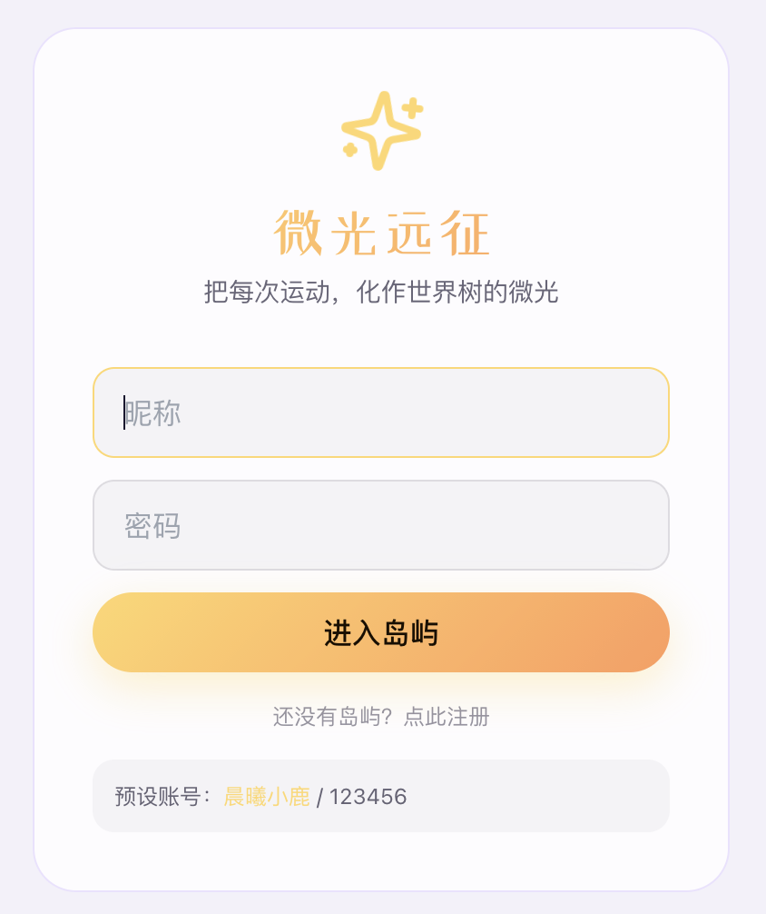</p>

提供 5 个目标卡片：减脂 / 体测冲刺 / 放松减压 / 塑形 / 社交运动 —— 覆盖大学生 90% 的运动动机。

#### 第 2 题 · 目前的运动水平？

<p align="center">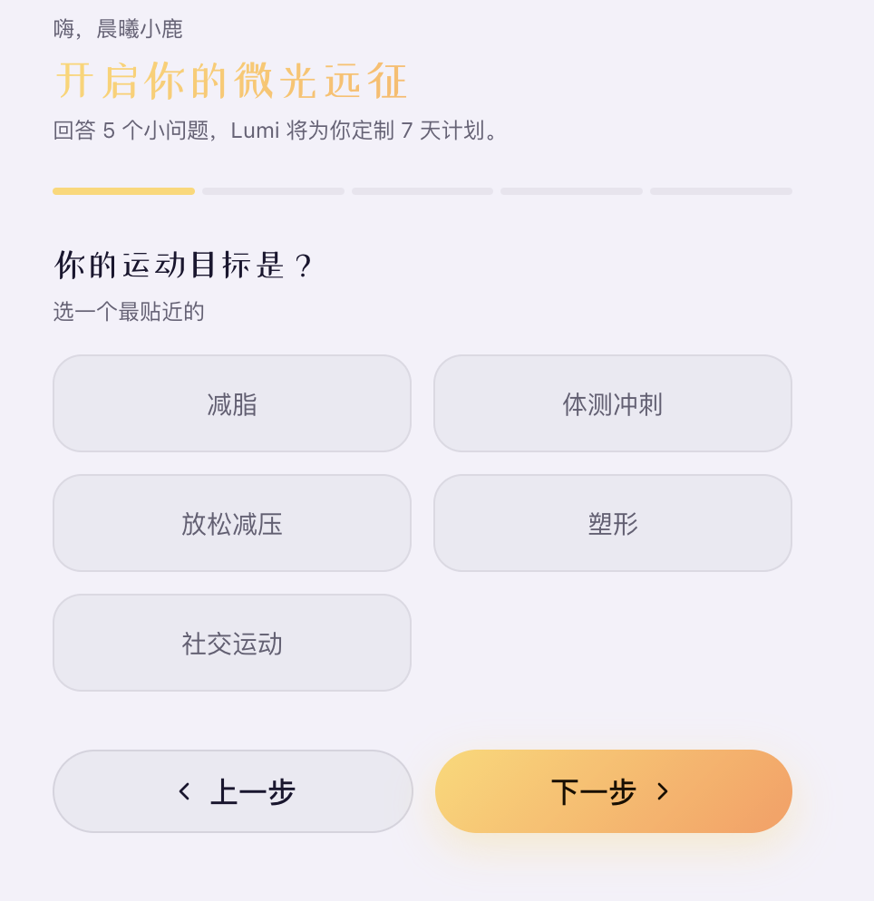</p>

"诚实就好，方案会根据你来定" —— 强调**评估而非考核**，几乎不运动也不会被劝退。

#### 第 3 题 · 你常出现在哪里？（多选）

<p align="center">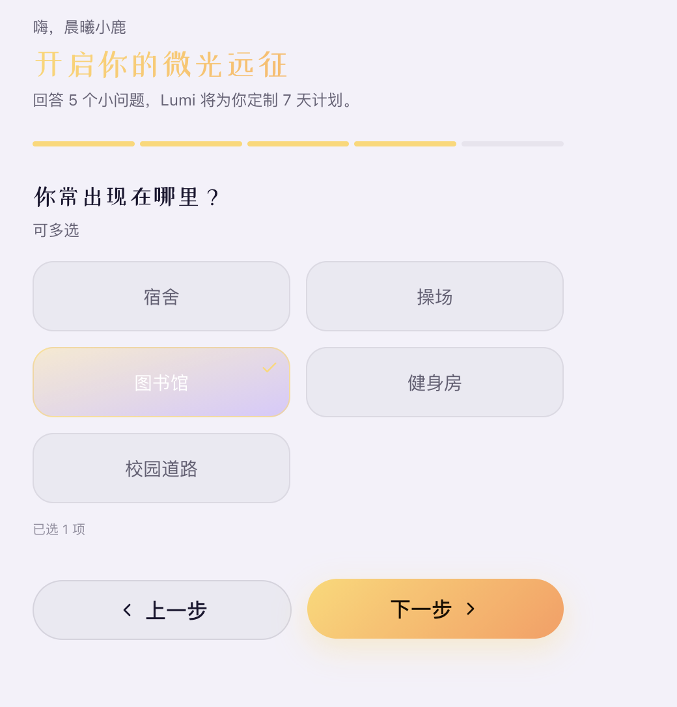</p>

宿舍 / 操场 / 图书馆 / 健身房 / 校园道路。这一题决定了后续能量卡片的**场景标签**——比如选了图书馆，就更会出现"楼梯攀登""窗边拉伸"等任务。

#### 第 4 题 · 每天能挤出多少时间？

<p align="center">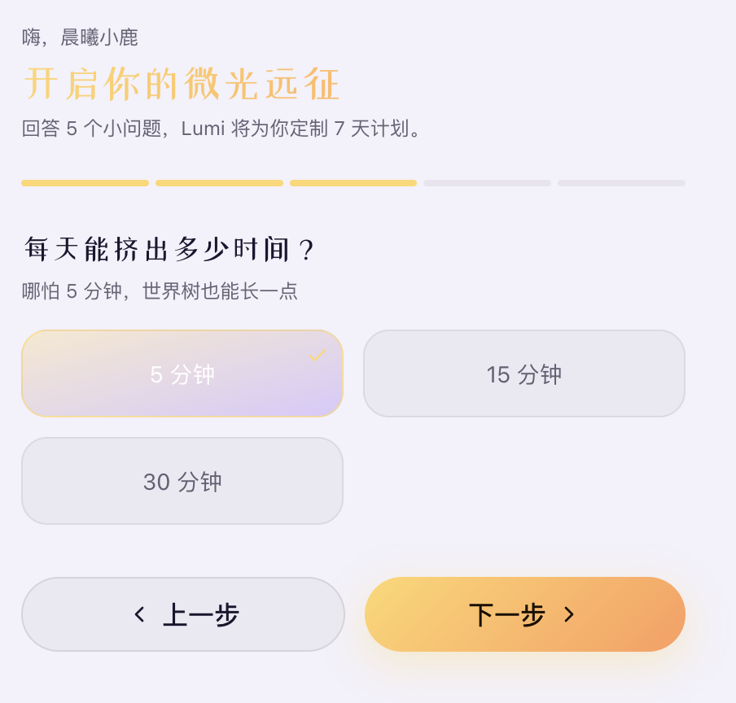</p>

5 分 / 15 分 / 30 分。文案"哪怕 5 分钟，世界树也能长一点" —— **持续接受微小投入**，对抗"必须运动 1 小时才有效"的焦虑。

#### 第 5 题 · 你喜欢哪种运动？

<p align="center">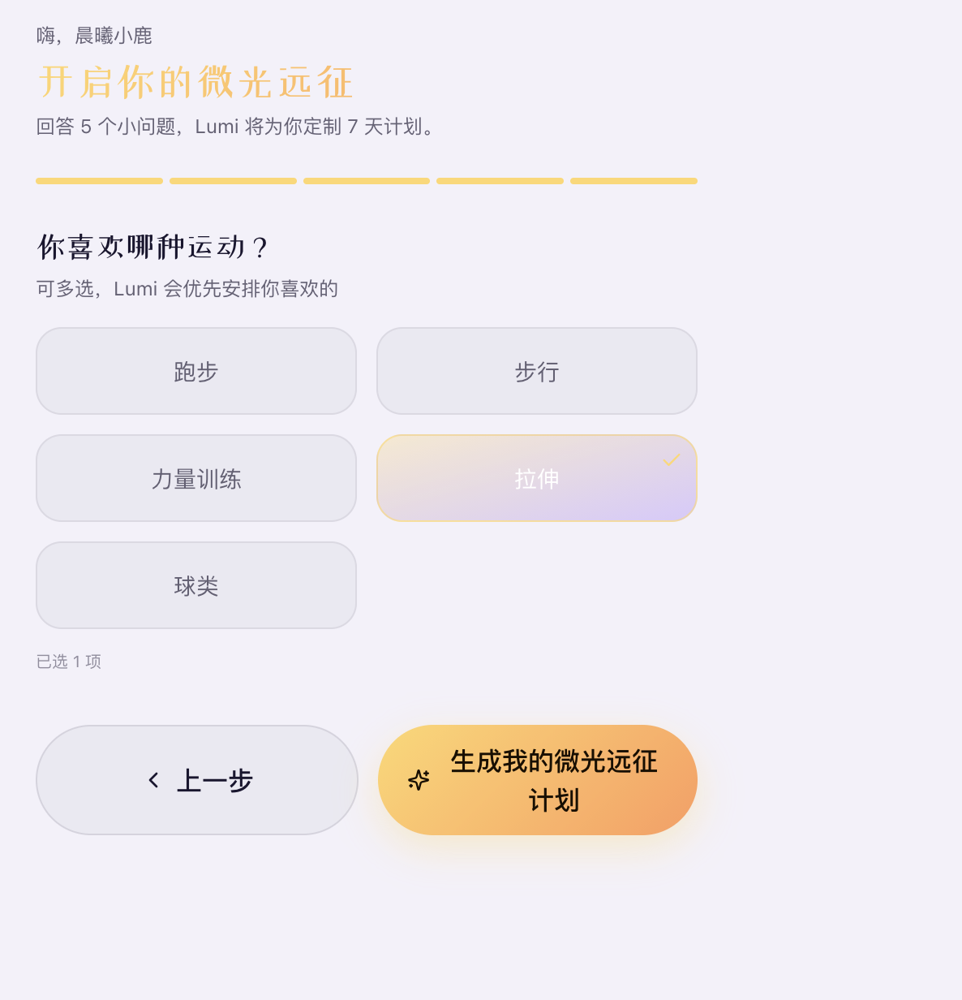</p>

最后一题 CTA 直接变成 ✨ **"生成我的微光远征计划"**，伴随渐变光晕，强化仪式感。

**为什么这样设计**
- 5 题、每题 3–5 选项 = 30 秒可完成，不会半路放弃
- 进度条始终在标题下，告知用户"还差几步"
- 每题选项卡片都有玻璃态 + 选中态光晕，**点击即满足感**
- 最后一题不是"提交"，而是"生成计划" —— 把无聊问卷转化为一次召唤仪式

---

### 4.3 岛屿首页 · `/`（今日行动中心）

整个产品的灵魂界面。一打开就能回答两个问题：**"我现在在哪？"** + **"今天要做什么？"**

#### 顶部：状态栏 + 世界树

<p align="center">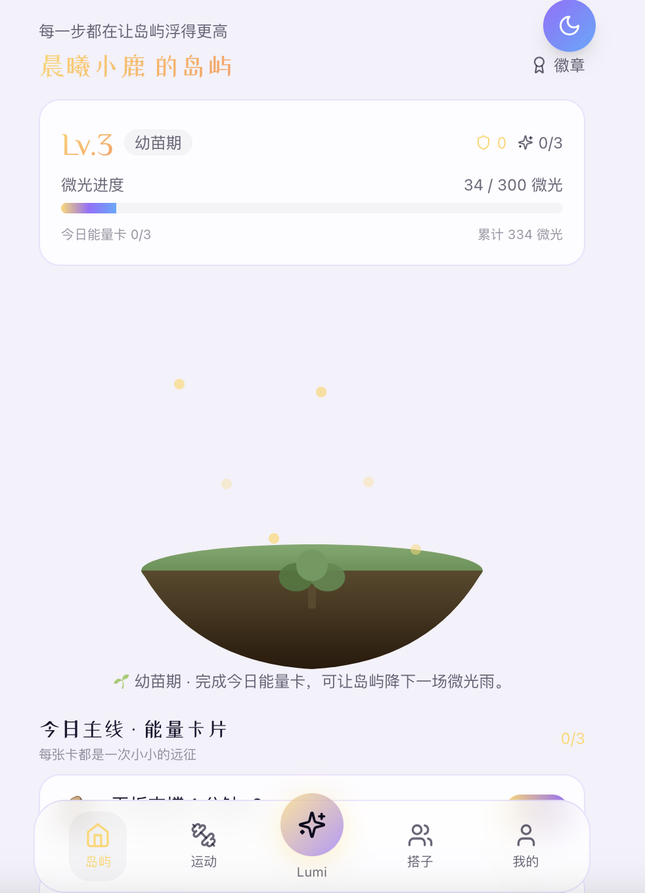</p>

- 副标"每一步都在让岛屿浮得更高" + 主标"晨曦小鹿 的岛屿"，让用户立刻获得**领地归属感**
- Lv.3 / 阶段标签 / 微光进度条（当前/下个阶段）/ 累计微光 一目了然
- **世界树**居中，旁边漂浮金色微光粒子，幼苗期是嫩绿小树
- 底部一句反馈："幼苗期 · 完成今日能量卡，可让岛屿降下一场微光雨。"

#### 中下：今日能量卡片 + 奖励预告 + 7 天计划

<p align="center">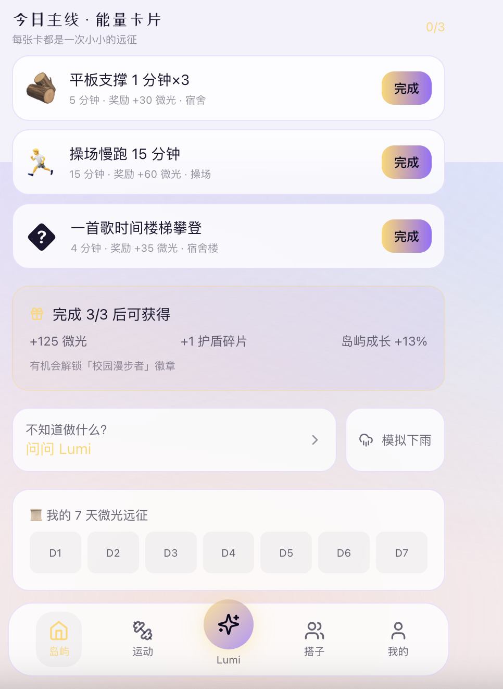</p>

- 「今日主线 · 能量卡片」3 张：每张含图标、任务名、时长、微光奖励、场景
  - 例：平板支撑 1 分钟×3 / 操场慢跑 15 分钟 / 一首歌时间楼梯攀登
- **完成 3/3 后可获得**：紫色玻璃卡聚合显示 +125 微光 / +1 护盾碎片 / 岛屿成长 +13% / 有机会解锁徽章
- 「不知道做什么？问问 Lumi」入口 + 「模拟下雨」彩蛋按钮
- 「我的 7 天微光远征」横向 D1–D7 圆球，已完成 = 金色，进行中 = 紫色

**为什么这样设计**
- 把"今日要做什么"和"我目前在哪"放在同一屏可见，**零决策即可行动**
- 世界树是产品的**情感锚点**，每次回首页第一眼看到它，就是一次正反馈
- "完成 3/3 后可获得"是**目标显化** —— 把碎片任务和长期奖励连成一条线
- 3 张能量卡的设计灵感来自卡牌游戏：每张都是一次小冒险，"集齐"动机比"清空 to-do" 更强

---

### 4.4 运动页 · `/sport`

<p align="center">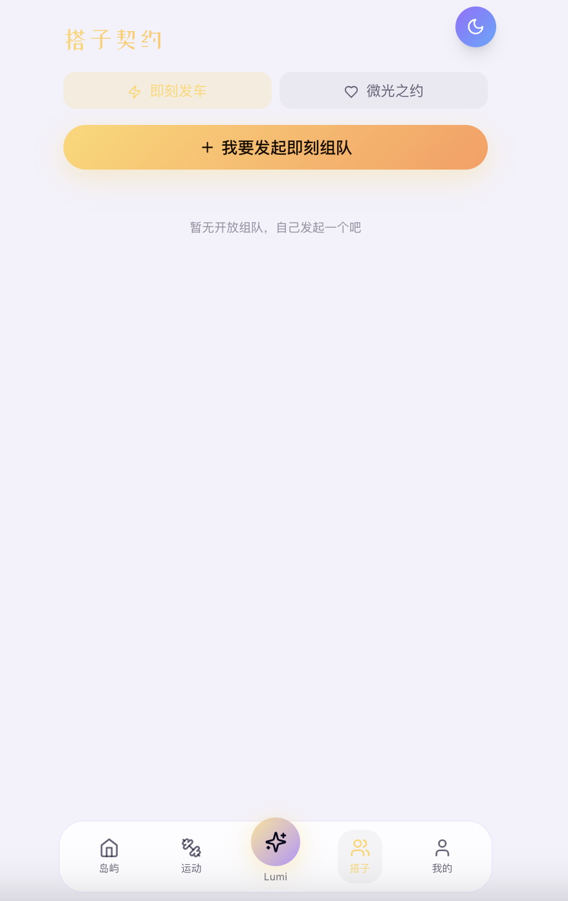</p>

**功能要点**
- 顶部 **Lumi 今日推荐**：紫色玻璃卡，按用户问卷答案给出当下最合适的运动建议（例："身体该柔软一下了 · 15 分钟拉伸，不出宿舍就能完成"），可一键采纳
- **8 种运动类型**：跑步 / 步行 / 力量 / 拉伸 / 球类 / 骑行 / 游泳 / 自定义
- **时长选择卡片** + 滑动条联动（5 / 10 / 20⚡ / 45⚡⚡ 分），20+ 标 1.5× 心流，45+ 标 2.0×
- 提示文案："连续运动 ≥ 20 分，触发心流暴击 1.5×" —— 在做出选择**之前**就预告奖励
- 大 CTA：「✓ 完成运动 · 灌溉世界树」 —— 动作语言而非数据语言

**为什么这样设计**
- 时长卡片直接预告"能拿到的微光数 × 倍率"，**让用户做更努力的选择**有动机
- 心流暴击不是数据加成，而是**收藏物**——把高强度运动变成可炫耀的稀有掉落
- 完成后随机概率掉落**心流暴击艺术卡**（专属插画 + 时间戳），可在我的页画廊回看，是天然的社交分享子弹
- CTA 文案「灌溉世界树」让一次"运动记录"被升华为"世界观行为"

---

### 4.5 Lumi 精灵 · `/lumi`

<p align="center">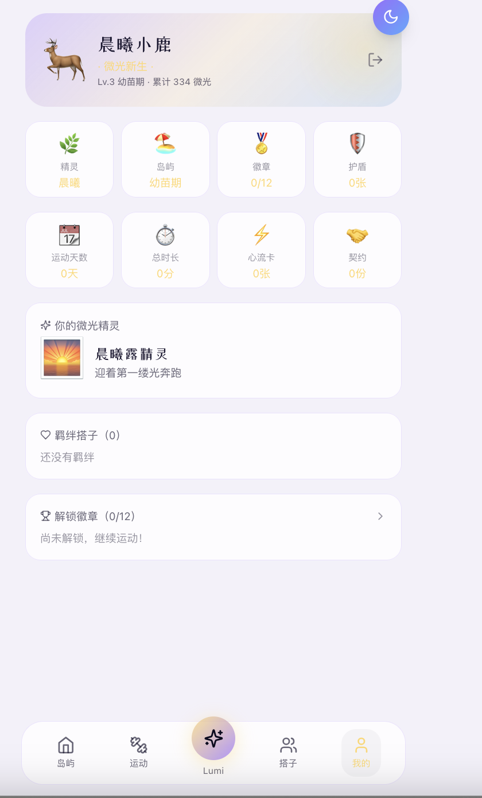</p>

**功能要点**
- 紫色精灵头卡："微光精灵 Lumi · 你的 AI 运动陪伴 · 温和、低压力"
- 开场白："我是你的微光精灵 Lumi。今天不用追求完美，只要点亮一点点微光就很好。✨"
- 用户气泡（金色）：「今天不想运动怎么办？」「体测快到了怎么练？」
- Lumi 回复（白色玻璃）+ **结构化建议任务列表**：原地踏步 2 分钟 +15、舒展拉伸 3 分钟 +20
- 大按钮 ✨ **「采用 Lumi 建议」** —— 一键把今日某张能量卡换成 Lumi 推荐的"软任务"
- 底部输入框 + 蓝色发送按钮

**为什么这样设计**
- 大学生求助情绪 ≠ 求助数据，传统问答 AI 输出表格让人更焦虑 → Lumi 优先共情后给方法
- 6 个高频痛点（不想动 / 中断恢复 / 体测 / 怎么吃 / 受伤 / 心情不好）做成快捷气泡，**点一下就拿到温柔回应**
- 「采用 Lumi 建议」是 AI 真正落到行动的桥：把对话价值变成**可执行的单次替换**，不留"建议但不操作"的空挡
- 底部凸起按钮（位于 BottomNav 中央，比其他按钮高一截）让 Lumi 是**全站随时可达的伙伴**

---

### 4.6 搭子契约 · `/social`

<p align="center">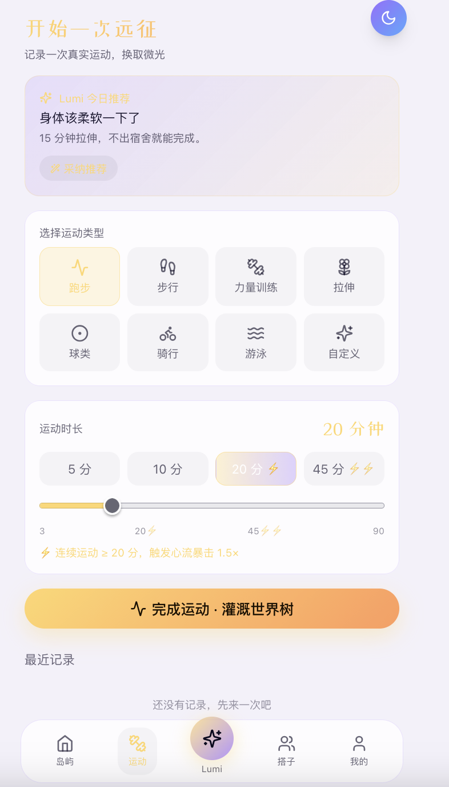</p>

**功能要点**
- 顶部双 tab：**即刻发车** / **微光之约**
- 大 CTA：「+ 我要发起即刻组队」 —— 一键发起即时组队（场景 / 时间 / 人数）
- 空状态文案："暂无开放组队，自己发起一个吧" —— 把空感转化为行动召唤
- 微光之约 tab：建立长期契约（连续 N 天 / 共完成 X 微光），双方进度同屏可视化，掉队时另一方触发"拯救动画"

**为什么这样设计**
- 单纯"邀请好友"功能在熟人少的大学早期没人愿意用 → **即刻发车**降低开荤门槛，可以拼陌生搭子
- **微光之约**把"让朋友监督我"翻译成"我们正在共同闯关"，**让责任变成羁绊**
- 拯救动画 + 共同徽章把社交互动**情感化**，而不只是数据 push 通知 —— 违约不是惩罚，是剧情节点

---

### 4.7 我的页 · `/profile`

<p align="center">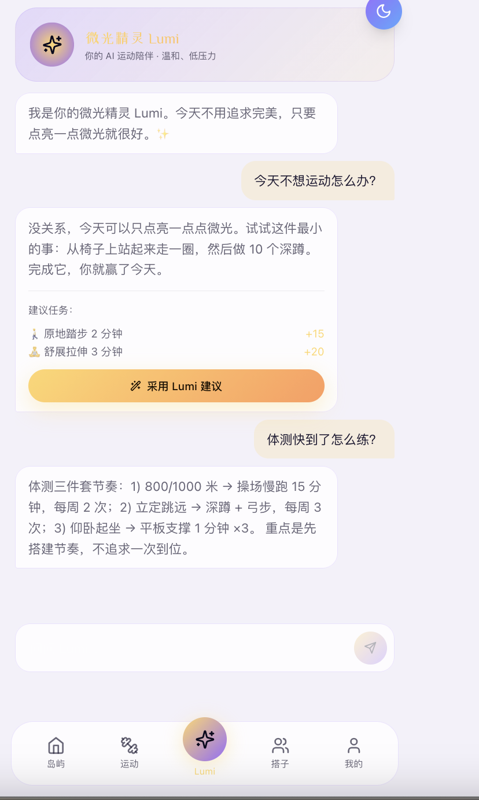</p>

**功能要点**
- 顶部角色卡：鹿头像 + 称号（"微光新生"）+ 「Lv.3 幼苗期 · 累计 334 微光」+ 右上角登出按钮
- **8 格身份资产瓷砖**：精灵 晨曦 / 岛屿 幼苗期 / 徽章 0/12 / 护盾 0张 / 运动天数 0天 / 总时长 0分 / 心流卡 0张 / 契约 0份
- 微光精灵卡片："晨曦露精灵 · 迎着第一缕光奔跑"
- 羁绊搭子（0）+ 解锁徽章（0/12）入口
- 顶部右侧固定的紫色月亮按钮 = **主题切换入口**（深色模式时是金色太阳）

**为什么这样设计**
- 我的页是**炫耀页**而不是设置页，所有内容都是给"未来的自己 + 朋友"看的
- 身份资产用 **8 格瓷砖布局**而不是文字列表，更像装备栏，扫一眼有"成就感"
- 即使新用户全部为 0，瓷砖也已经全部存在，用户能清晰看到「这些坑等我去填」 —— **未来感优于成绩单**
- 主题切换按钮做成有色彩的实色渐变球，浮在容器右上角，**绝不会错过**

---

### 4.8 主题切换 · 深色 / 浅色

<p align="center">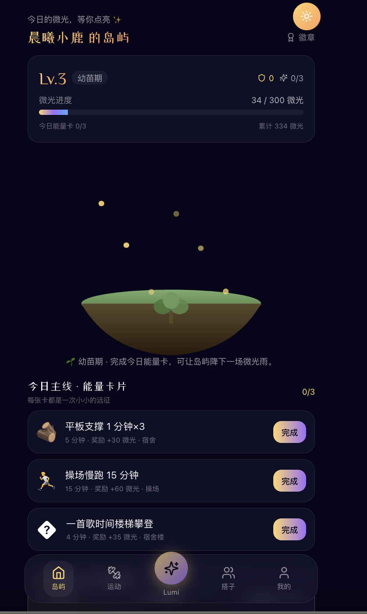</p>

**功能要点**
- 整个站点支持双主题，**CSS 变量 + `data-theme` 选择器**驱动
- 深色模式下：背景 `#06051A` 夜空蓝、玻璃卡 `rgba(22,20,48,0.6) + blur(12px)`、金色微光更亮
- 切换按钮在每个 max-w-md 容器右上角，深色 = 金色太阳 ☀️，浅色 = 紫色月亮 🌙
- 选择持久化到 `localStorage`，下次打开保持

**为什么这样设计**
- 深色更接近"奇幻夜空"的产品调性，是**视觉首选**
- 但白天上课 / 户外强光，深色又难看清 → 必须保留浅色作为友好兜底
- 用 CSS 变量重写 `glass`、`text`、`bg` 等通用 class，避免一份组件写两套样式
- 切换按钮用纯实色渐变球（不再使用透明玻璃），**保证在任何主题、任何背景上都醒目可见**

---

## 五、视觉与交互系统

### 5.1 配色

| 角色 | 颜色 | 用途 |
|---|---|---|
| 主背景（深色） | `#06051A` | 夜空底色 |
| 主背景（浅色） | `#F4F1FA` | 治愈淡紫 |
| 微光金 | `#FFD86B → #FF9C5B` | CTA / 高亮 / 进度条 |
| 精灵紫 | `#9C6BFF` | Lumi / 紫色光晕 |
| 海洋蓝 | `#5BA8FF` | 步行 / 游泳 |
| 玻璃卡片（深） | `rgba(22,20,48,0.6) + blur(12px)` | 主要容器 |
| 玻璃卡片（浅） | `rgba(255,255,255,0.78) + blur(12px)` | 主要容器 |

### 5.2 动效（Framer Motion）
- **世界树呼吸**：scale 1 ↔ 1.02，4 秒循环
- **微光粒子飘升**：完成任务时从树底升起金色粒子
- **心流暴击艺术卡**：完成的瞬间用 `spring` 弹入
- **拯救动画**：搭子掉队时，另一方进度条延伸一只手抓住小人

### 5.3 字体 + 排版
- 中文：系统默认（PingFang / 黑体），保证清晰
- 数字 / 英文：稍微加大字重，营造"游戏 HUD"感
- 关键标题用线性渐变金（`text-gradient-gold`），普通正文留白足够

---

## 六、核心玩法机制

### 6.1 微光（核心货币）

```
基础能量 = 时长（分钟） × 类型系数
心流暴击：连续 ≥ 20 分钟 1.5×；≥ 45 分钟 2.0×
最终微光 = floor(基础能量 × 心流倍率)
```

类型系数（节选）：

| 类型 | 系数 |
|---|---|
| 跑步 | 3.0 |
| 力量 | 2.5 |
| 骑行 | 2.0 |
| 步行 | 1.5 |
| 拉伸 | 1.0 |

### 6.2 世界树阶段

| 阶段 | 累计微光 | 视觉 |
|---|---|---|
| 幼苗 | 0–999 | 浮岛 + 嫩绿小树 |
| 成长 | 1000–4999 | 树干粗壮 + 光斑 |
| 传说 | 5000+ | 巨树 + 落英 + 紫色精灵环绕 |

### 6.3 能量卡片每日刷新

- 每天 0 点重置 3 张
- 每张关联：场景（宿舍 / 操场 / 任意） + 时长（5–15 min） + 奖励微光
- 集齐 3 张奖励**护盾 1 张**（中断 1 天不掉等级）

### 6.4 心流卡

- 25% 概率从达成心流暴击的运动中掉落
- 含日期 / 类型 / 时长 / 倍率 / 寄语
- 永久保留在「我的」画廊中

---

## 七、AI 能力 · Lumi 精灵

### 7.1 角色定义
Lumi 不是助手，是**与你共同冒险的微光精灵**。所有回复以"我们"作主语而非"你"。

### 7.2 6 个快捷场景与回应模板

| 场景 | Lumi 风格 | 是否含"采纳建议" |
|---|---|---|
| 不想动 | 共情 + 替换为 3 分钟深呼吸卡 | ✅ |
| 中断恢复 | 欢迎回归 + 推荐"重启之路"软任务 | ✅ |
| 体测备考 | 温柔挑战 + 阶梯式训练建议 | ✅ |
| 怎么吃 | 三个简餐组合，无热量焦虑 | ❌ |
| 受伤 | 立即下调强度 + 拉伸推荐 | ✅ |
| 心情不好 | 不强调运动，先共情 + 5 分钟散步 | ✅ |

### 7.3 7 天计划生成
基于 Onboarding 5 题答案，前端组合关键词、后端用模板生成 7 天奇幻命名任务。每一天的 task / minutes / energy / type 是真实可执行的，但**呈现给用户的是命名**，而非数字。

---

## 八、技术架构

### 8.1 整体

```
┌─────────────────────────────────────┐
│  浏览器（手机优先 max-w-md）         │
│  React 18 + TS + Tailwind + Framer  │
└──────────────┬──────────────────────┘
               │ HTTPS
               ▼
┌─────────────────────────────────────┐
│  Netlify CDN（前端静态资源）         │
└─────────────────────────────────────┘
               │ /api/* → fetch
               ▼
┌─────────────────────────────────────┐
│  Render Web Service（Node + Express）│
│  better-sqlite3 + JWT               │
└─────────────────────────────────────┘
```

### 8.2 前端

| 项 | 选型 |
|---|---|
| 构建 | Vite 5 |
| 框架 | React 18 + TypeScript |
| 样式 | Tailwind CSS（自定义 `glimmer-*` 调色板） |
| 动效 | Framer Motion |
| 状态 | Zustand（user / theme / toast） |
| 路由 | React Router v6 |
| 图标 | Lucide React |
| 图表 | Recharts |
| 主题 | CSS 变量 + `[data-theme]` 选择器 |

### 8.3 后端

| 项 | 选型 |
|---|---|
| 运行时 | Node 20 |
| 框架 | Express 4 |
| 数据库 | better-sqlite3（嵌入式，零依赖部署） |
| 鉴权 | JWT（无 refresh，30 天有效） |
| 跨域 | CORS 全开（无 cookie，纯 token） |

### 8.4 关键 API（节选）

| Method | Path | 用途 |
|---|---|---|
| POST | `/api/auth/login` / `/register` | 鉴权 |
| GET | `/api/user/me` | 当前用户（含 stage / plan / onboarded） |
| POST | `/api/onboarding/submit` | 提交问卷生成 7 天计划 |
| GET | `/api/tasks/today/preview` | 今日 3 张能量卡 + 奖励聚合 |
| POST | `/api/tasks/:id/complete` | 完成能量卡 |
| POST | `/api/sports` | 记录真实运动并结算微光 |
| GET | `/api/lumi/prompts` | 6 条快捷问题 |
| POST | `/api/lumi/adopt-soften` | 采纳 Lumi 推荐替换今日卡 |
| GET | `/api/achievements` | 12 枚徽章 + 进度 |

---

## 九、数据模型（核心表）

```sql
users(id, nickname, password, avatar, preference, energy,
      level, onboarded, plan_json, stage, ...)

daily_tasks(id, user_id, card_id, date, completed)

sports(id, user_id, type, minutes, energy_gained,
       multiplier, flow_card, created_at)

contracts(id, user_a, user_b, days, target_energy,
          progress_a, progress_b, status, ...)

achievements_user(user_id, ach_id, unlocked_at, progress)
```

---

## 十、部署与上线

### 10.1 前端 · Netlify
- 本地 `npm run build` 生成 `frontend/dist/`
- 上传到 Netlify Drop（已认领账号 → 永久 + 无密码）
- 自定义域名 `glimmer-expedition.netlify.app`

### 10.2 后端 · Render
| 字段 | 值 |
|---|---|
| Root Directory | `backend` |
| Build Command | `npm install --include=dev && npm run build` |
| Start Command | `npm start` |
| Instance Type | Free |

15 分钟无访问休眠，冷启动约 30 秒，对评审展示足够。

### 10.3 持久化策略
SQLite 文件随容器生命周期；评审场景下种子用户每次启动自动重建，不影响体验。生产场景计划升级到 Render Postgres / Neon。

---

## 十一、差异化亮点

1. **视觉成长可视化**：世界树是这个产品的灵魂，不是装饰
2. **心流暴击艺术卡**：把高强度运动从"累"变成"稀有掉落"
3. **能量卡片今日 3 张**：零决策启动，碎片化友好
4. **微光之约 + 拯救动画**：让社交监督具像化为剧情
5. **Lumi 一键替换软任务**：AI 不只是建议，而是直接落到行动
6. **CSS 变量驱动的双主题**：浅色不是 hack，是首选
7. **完整产品闭环**：登录 → 引导 → 行动 → 反馈 → 收集 → 社交 → 回到首页，无断点

---

## 十二、未来规划

| 优先级 | 功能 | 说明 |
|---|---|---|
| ⭐️⭐️⭐️ | 接入手机健康数据 | iOS HealthKit / 微信运动 |
| ⭐️⭐️⭐️ | 真实 LLM 替换 Lumi mock | OpenAI / 通义千问，做长记忆 |
| ⭐️⭐️ | 岛屿装扮 / 皮肤系统 | 微光兑换 |
| ⭐️⭐️ | 社团 / 学院战 | 多人 PVP 微光累计 |
| ⭐️ | 数据回看年报 | 年终个人冒险史诗 |

---

## 致评审

感谢读到这里。这个作品从产品定义、视觉系统到工程实现，全部围绕同一个问题：

> **能不能让大学生在不被催促的情况下，自然地、长期地动起来？**

我们的回答是：**用奇幻、即时反馈和温柔的 AI 同伴，把运动从"任务"变成"远征"。**

> 🌟 现在就打开 https://glimmer-expedition.netlify.app 开启第一次远征吧。
